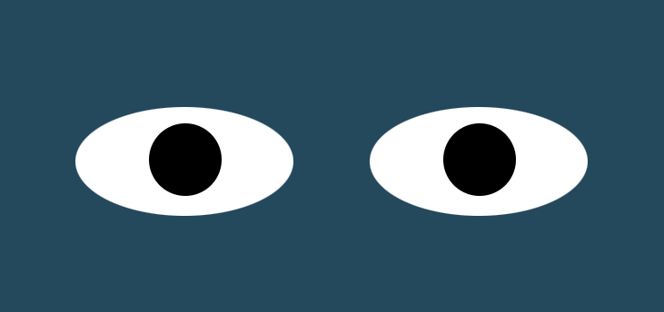

# Eye Exercise

## Description
The result of this exercise was an animation of eyes following your cursor as it moves around the screen. This was completed using JavaScript HTML and CSS.

## How to Run
If you download all the files and contain them in the same directory, you can run this animation locally by loading the index.html file onto your browser.
 
<a href="https://kayla-day.github.io/Eye-Exercise/">Give it a try!</a>

## Future Improvements
There aren't any future improvements I plan on making at this time but if I decide to return to this exercise in the future I might play around with the image my cursor's movement manipulates. I.e. hair instead of eyes, or something entirely different like a bumble bee that follows the cursor. 

## License
MIT License

Copyright (c) 2023 Kayla Guimont

Permission is hereby granted, free of charge, to any person obtaining a copy of this software and associated documentation files (the "Software"), to deal in the Software without restriction, including without limitation the rights to use, copy, modify, merge, publish, distribute, sublicense, and/or sell copies of the Software, and to permit persons to whom the Software is furnished to do so, subject to the following conditions:

The above copyright notice and this permission notice shall be included in all copies or substantial portions of the Software.

THE SOFTWARE IS PROVIDED "AS IS", WITHOUT WARRANTY OF ANY KIND, EXPRESS OR IMPLIED, INCLUDING BUT NOT LIMITED TO THE WARRANTIES OF MERCHANTABILITY, FITNESS FOR A PARTICULAR PURPOSE AND NONINFRINGEMENT. IN NO EVENT SHALL THE AUTHORS OR COPYRIGHT HOLDERS BE LIABLE FOR ANY CLAIM, DAMAGES OR OTHER LIABILITY, WHETHER IN AN ACTION OF CONTRACT, TORT OR OTHERWISE, ARISING FROM, OUT OF OR IN CONNECTION WITH THE SOFTWARE OR THE USE OR OTHER DEALINGS IN THE SOFTWARE.
